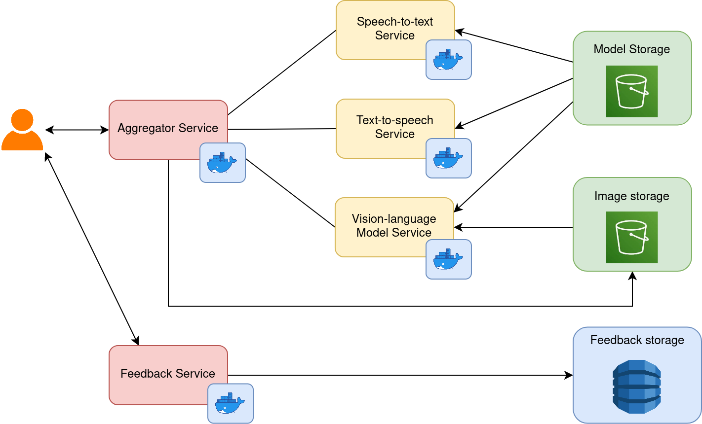
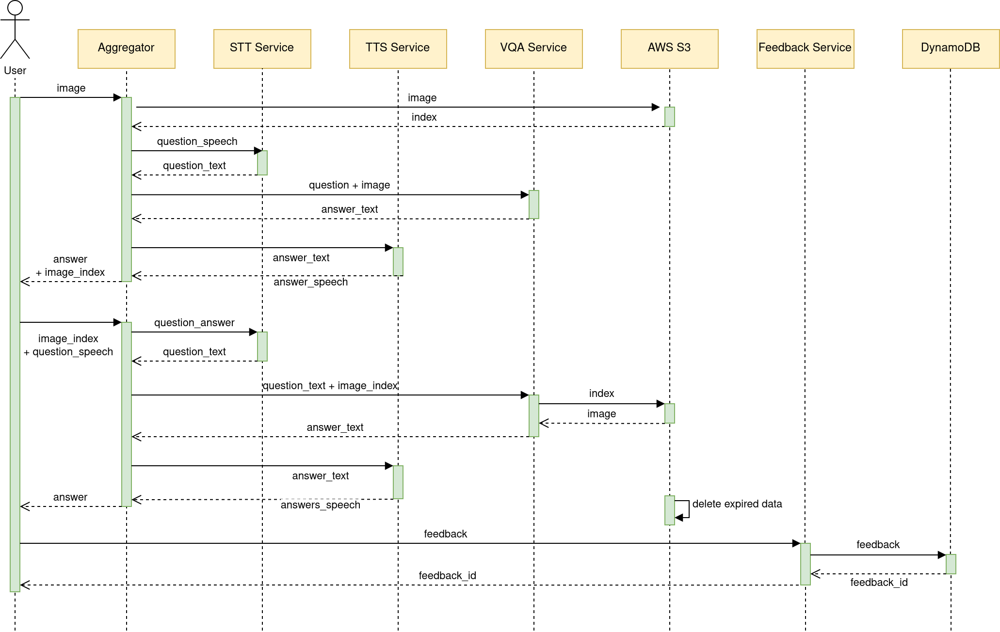
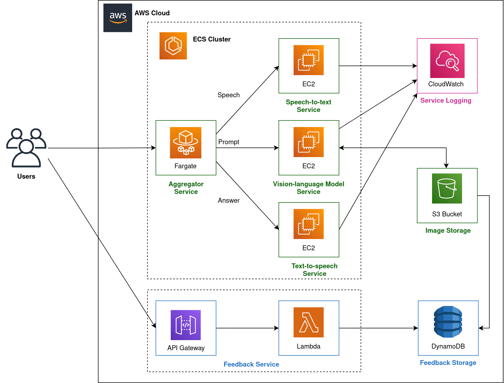
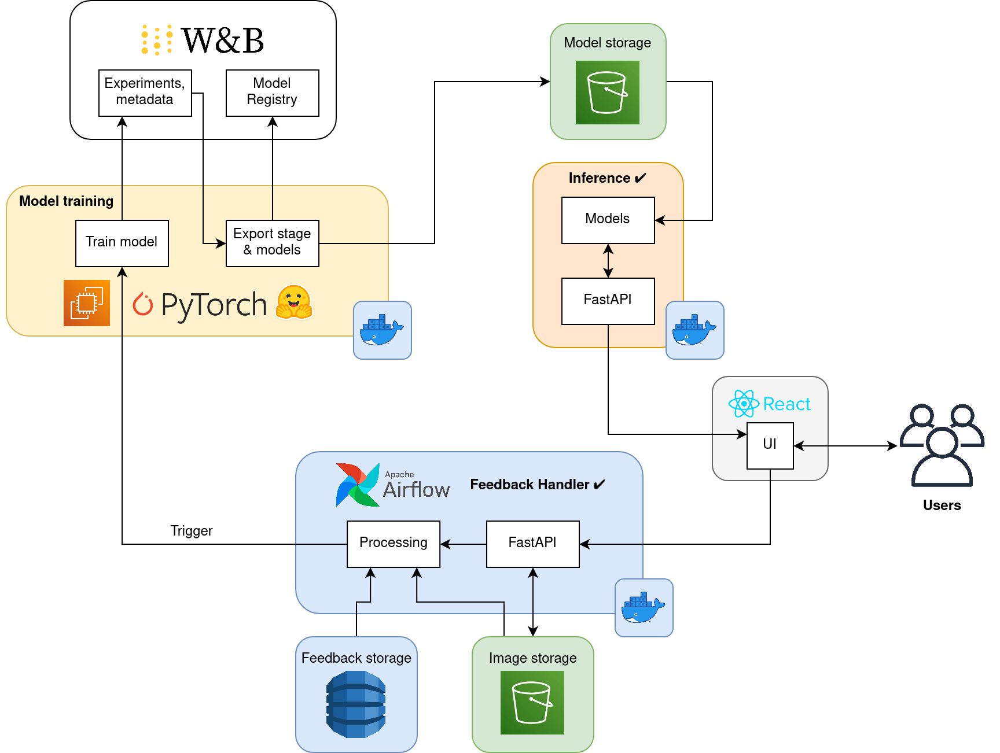

# Vision Assistant Services

## Description
Vision Assistant is an innovative and accessible application designed to empower visually impaired individuals by enabling them to ask questions and receive answers about the content of images. Leveraging vision language models, Vision Assistant breaks down barriers to information and enhances independence for users with visual impairments.

## Backend Key Features
- **Image Understanding:** Vision Assistant employs advanced computer vision technology to analyze images and extract meaningful information from them.
- **Natural Language Interaction:** Users can interact with the application using natural language queries, allowing them to ask questions about the content of the scenes/images in both speech-form and text-form.
- **Detailed Response:** Vision Assistant provides detailed answer, describing the elements, objects, and more within the scenes.
- **Feedback Collecting**: The application receives users' feedback, retrains model, improves user experience.

## System Design
The backend is built following the `Aggregator` microservices design pattern. The Aggregator Service works as an entrypoint, invokes functional services, aggregates outputs, and response to users.

## Services
Documents for APIs development and deployment:
- [Visual Question Anwsering](./apis/vision_language_models/README.md)
- [Speech-to-Text](./apis/stt/README.md)
- [Text-to-Speech](./apis/tts/README.md)
- [Feedback Handler](./apis/feedback/README.md)
- [Aggregator](./apis/aggregator/README.md)

## Interservice Communications
For the sake of simplicity, we select the `Synchronous Interservice Communication`, in which a service calls an API that another service exposes, using HTTP protocol.

## Deployment
The Vision Assistant backend is deployed on the AWS Cloud infrastructure, leveraging a combination of services to ensure scalability, reliability, and accesibility. The microservices are dockerized and orchestrated using AWS ECS with EC2 and Fargate launch types. Below is an overview of the deployment solution and the AWS services involved:

## Future Work
- Our future endeavors will focus on further enhancing the VQA service, with particularly emphasis on optimizing the Vision-language model
- **User-Centric Retraining:** we are dedicated to building a training platform that harnesses users' feedback effectively, allowing us to iteratively fine-tune the model based on real-world usage scenarios and user-generated questions.

## Contributing
As the project is made by multiple services, please follow the guid corresponding to the service you want to contribute to.